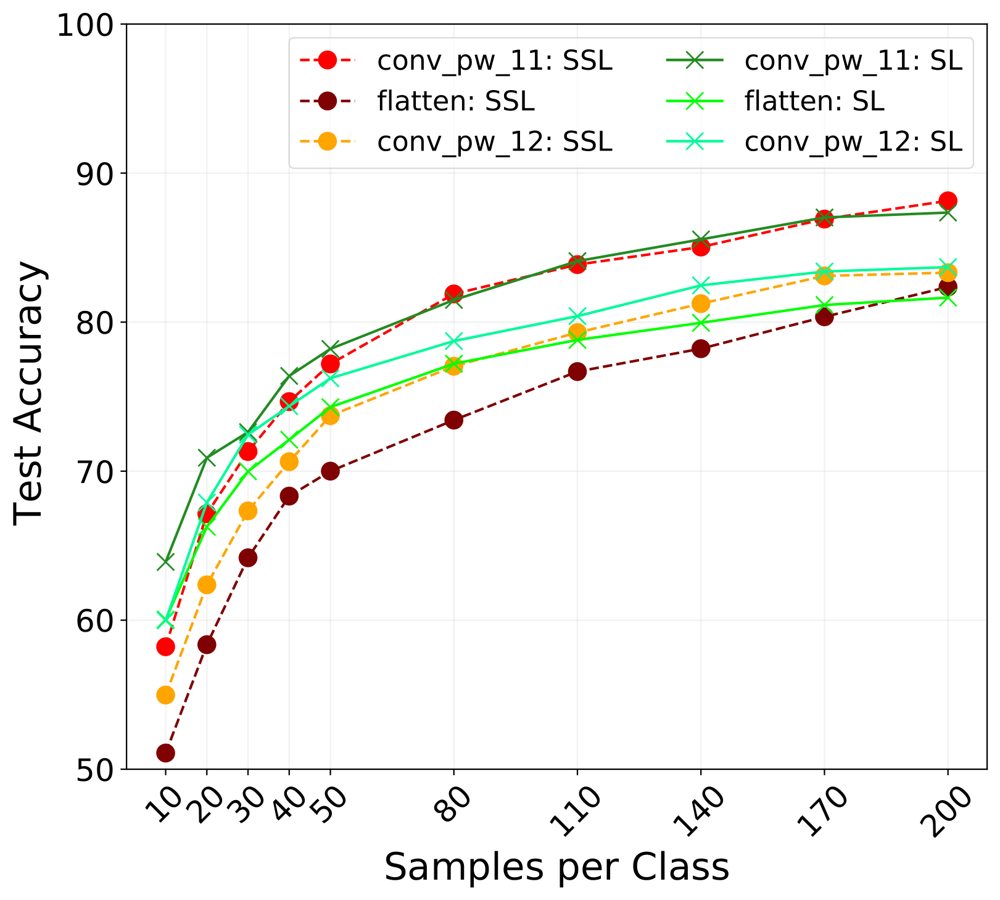
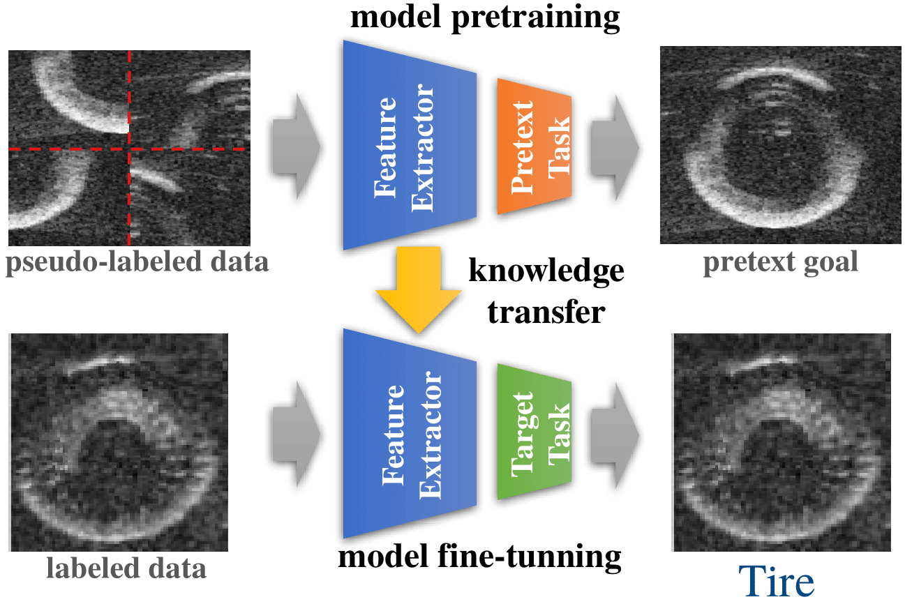
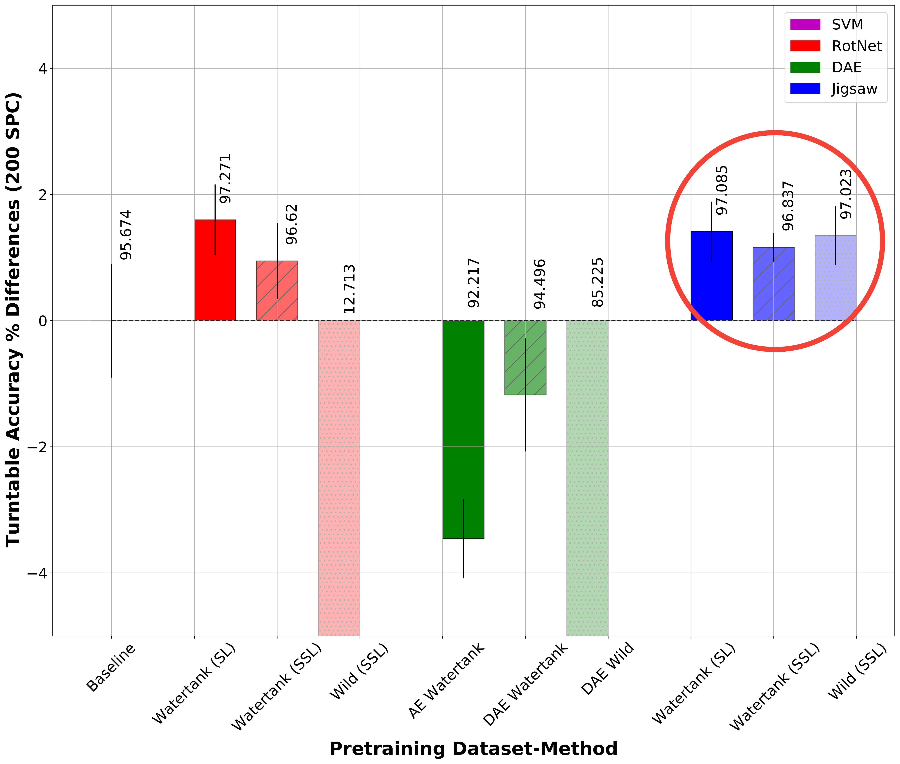

# Self-supervised Learning for Sonar Image Classification

This is the official repository for the ssl-sonar-images paper published at the LatinX in AI workshop @CVPR2022. 

> [**Self-supervised Learning for Sonar Image Classification**](https://openaccess.thecvf.com/content/CVPR2022W/LXCV/papers/Preciado-Grijalva_Self-Supervised_Learning_for_Sonar_Image_Classification_CVPRW_2022_paper.pdf)
> Alan Preciado-Grijalva, Bilal Wehbe, Miguel Bande Firvida, Matias Valdenegro-Toro
> CVPR 2022

[[poster]](https://drive.google.com/file/d/1PLXS9nMxL3WcPQGf41DDalHg7BT_Ju07/view?usp=sharing) [[talk]](https://drive.google.com/file/d/1kzS0SWO63IoukyvWY_3YfYcuzzFM-ypo/view?usp=sharing)

Abstract
-----------------
Self-supervised learning has proved to be a powerful approach to learn image representations without the need of large labeled datasets. For underwater robotics, it is of great interest to design computer vision algorithms to improve perception capabilities such as sonar image classification. Due to the confidential nature of sonar imaging and the difficulty to interpret sonar images, it is challenging to create public large labeled sonar datasets to train supervised learning algorithms. In this work, we investigate the potential of three self-supervised learning methods (RotNet, Denoising Autoencoders, and Jigsaw) to learn high-quality sonar image representation without the need of human labels. We present pre-training and transfer learning results on real-life sonar image datasets. Our results indicate that self-supervised pre-training yields classification performance comparable to supervised pre-training in a few-shot transfer learning setup across all three methods.

Highlights
-----------------
- **Datasets:** We present real-life sonar datasets for pretraining and transfer learning evaluations
- **SSL Approaches:** We study 3 self-supervised learning algorithms to learn representations without labels (RotNet, Denoising Autoencoders, Jigsaw Puzzle)
- **Pretrained Models:** We provide pretrained models for further computer vision research on sonar image datasets 
- **Results:** Our results indicate that self-supervised pretraining yields competitive results against supervised pretraining



Self-supervised Learning for Sonar Images
-----------------



Results on Watertank and Wild Sonar Data Pretraining
-----------------


Citation
-----------------
If you find our research helpful, please consider citing:

```
@InProceedings{Preciado-Grijalva_2022_CVPR,
    author    = {Preciado-Grijalva, Alan and Wehbe, Bilal and Firvida, Miguel Bande and Valdenegro-Toro, Matias},
    title     = {Self-Supervised Learning for Sonar Image Classification},
    booktitle = {Proceedings of the IEEE/CVF Conference on Computer Vision and Pattern Recognition (CVPR) Workshops},
    month     = {June},
    year      = {2022},
    pages     = {1499-1508}
}

```


